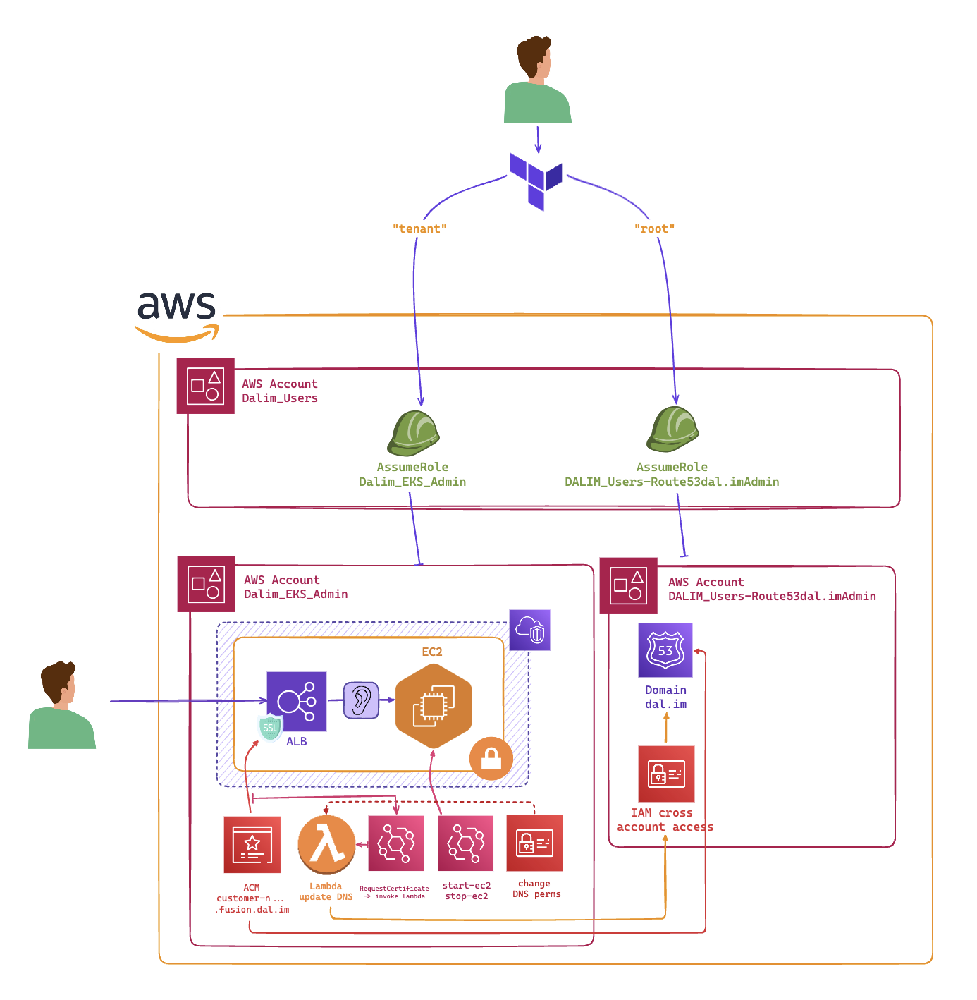
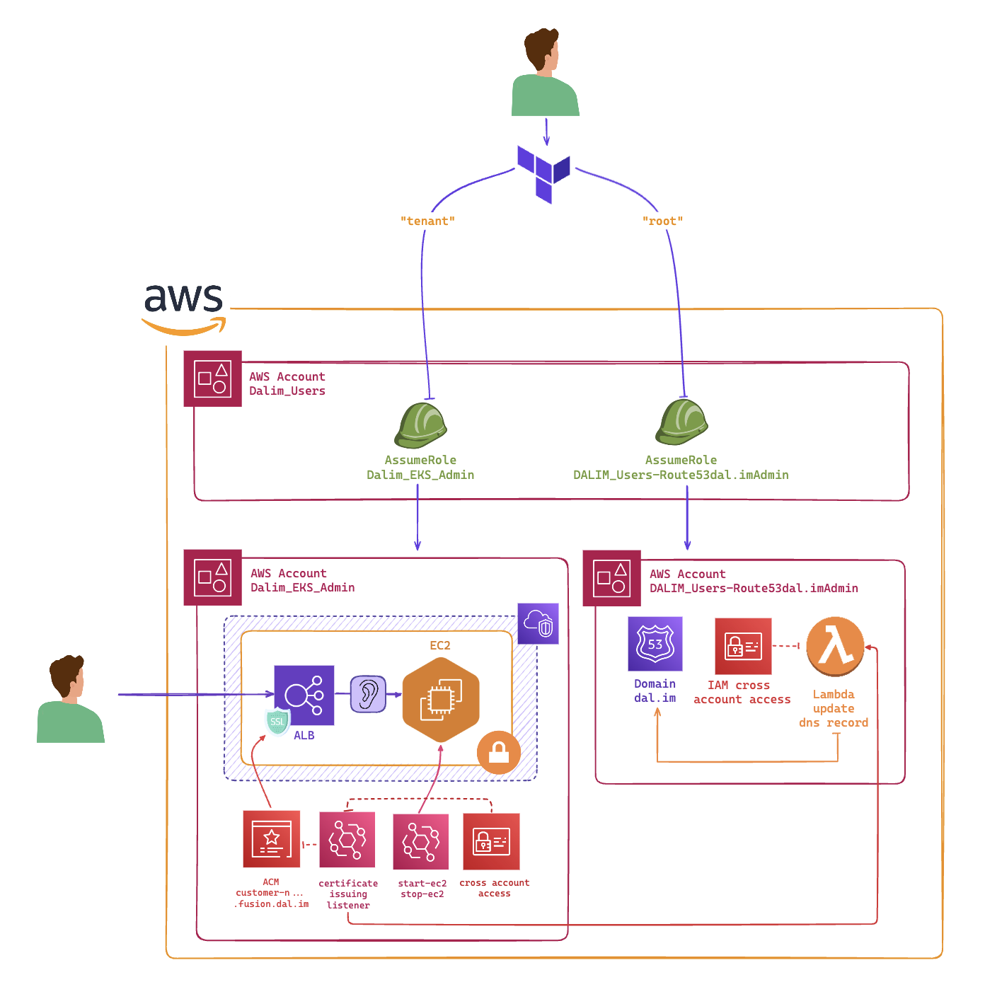

## TLDR

Solution is trivial, but the problem _is not_.

The problem is to validate a certificate in a different account. The solution is to create the certificate in the tenant account, add a DNS record in the route53 in the dns_admin account, validate the certificate in the tenant account, and continue with the infrastructure using **provider aliases**.

Head over to the [solution](#solution) section for the code.

## Context

During my first month at my part-time job, I was working on an infrastructure automation problem with `Terragrunt`.

The goal was to automate the creation of tenants for early adopters of the new SaaS. The infrastructure was divided into two accounts: `tenant` and `dns_admin`.

At some point, I needed to obtain an SSL certificate for the load balancer in the tenant account. However, in order to issue the certificate, I had to prove to AWS that we owned the domain we wanted to secure with that certificate.

This is called **DNS validation**.

The challenge was that the certificate was being issued in the `tenant` account, but the DNS hosted zones were in Route 53 of the `dns_admin` account.


When working with Terraform, I usually try to replicate the same step as I would do manually inside the AWS console.


## What is DNS validation?

**DNS validation** is a method used by AWS to confirm ownership of a domain before issuing an SSL/TLS certificate via ACM (AWS Certificate Manager). It involves creating a DNS record in your domain's DNS configuration, proving to AWS that you control the domain.

The process consists of the following steps:

1. **Request a certificate** in AWS ACM for a specific domain, specifying `DNS` as the validation method.

   - You can request a certificate for either a primary domain like `example.com`, or a subdomain like `app.example.com`.
   - At this point, AWS provides a set of **Domain Validation Options**, which include details about the DNS records you need to create.

2. **Create DNS records** in your domain's DNS hosted zone.

   - A hosted zone is the container for DNS records in **Route 53**, AWS's DNS service. You can think of it as a domain's configuration file containing details like IP addresses, mail servers, and other settings.
   - AWS asks you to create a DNS `CNAME` record. The name and value of this record are provided by ACM and must be added to your domain's hosted zone.

   Here's what a typical DNS record for validation might look like:

   - **Name**: `_abcde.example.com`
   - **Type**: `CNAME`
   - **Value**: `_xyz.acm-validations.aws`

3. **Validation by AWS**:

   - Once the record is added, AWS periodically checks your DNS records to ensure the correct validation information is present.
   - When ACM finds the `CNAME` record in your hosted zone, it confirms that you own the domain, and the certificate is marked as **validated**.

4. **Issue the certificate**:

   - After successful validation, ACM issues the SSL/TLS certificate, and you can use it to secure your web applications, load balancers, or other services.
   - This validation remains valid as long as the DNS record is present. If the record is removed, the certificate may not renew automatically.

---

By using DNS validation, the certificate will automatically renew as long as the DNS record remains intact, meaning you don't need to repeat the validation process every time your certificate is up for renewal. This is especially useful in automated setups where human intervention is minimized.

## Solutions I tried (and failed)

> If someone tries one of these solutions and make it work, please let me know, I spent so much time on this :/

### Using a Lambda in the `tenant` account



### Using a Lambda in the `dns_admin` account



## Solution

```bash
provider "aws" {
    alias   = "dns_admin"
    region  = var.route53_aws_region
    profile = "dns_admin"
}


locals {
    domain = "dal.im"
}


resource "aws_acm_certificate" "fusion_certificate" {
    domain_name       = local.domain
    validation_method = "DNS"


    lifecycle {
    create_before_destroy = true
    }


    tags = {
    cross_validation = "dns-validation"
    }
}


data "aws_route53_zone" "this" {
    provider     = aws.dns_admin
    name         = local.domain
    private_zone = false
}


resource "aws_route53_record" "this" {
    provider = aws.dns_admin


    for_each = {
    for dvo in aws_acm_certificate.fusion_certificate.domain_validation_options : dvo.domain_name => {
        name   = dvo.resource_record_name
        record = dvo.resource_record_value
        type   = dvo.resource_record_type
    }
    }


    allow_overwrite = true
    name            = each.value.name
    records         = [each.value.record]
    ttl             = 60
    type            = each.value.type
    zone_id         = data.aws_route53_zone.this.zone_id
}


resource "aws_acm_certificate_validation" "this" {
    certificate_arn         = aws_acm_certificate.fusion_certificate.arn
    validation_record_fqdns = [for record in aws_route53_record.this : record.fqdn]
}
```

## Now, looking back ...

I was mostly focused on the organizational aspect of the problem, trying to align processes and communication. However, I realized that the real challenge was not organizational but technical.

I was limited by how Terraform intrinsically manages variables and providers. I couldn't find a way to create a DNS record in one account and validate a certificate in another account using Terraform alone because I had dependencies between the resources that would live in different accounts.

With provider aliases, I was able to create resources that were dependent on each other but lived in different accounts _in the same Terraform module_, so **the variables were living in the same context** and it was easy to pass them around to the different resources.


