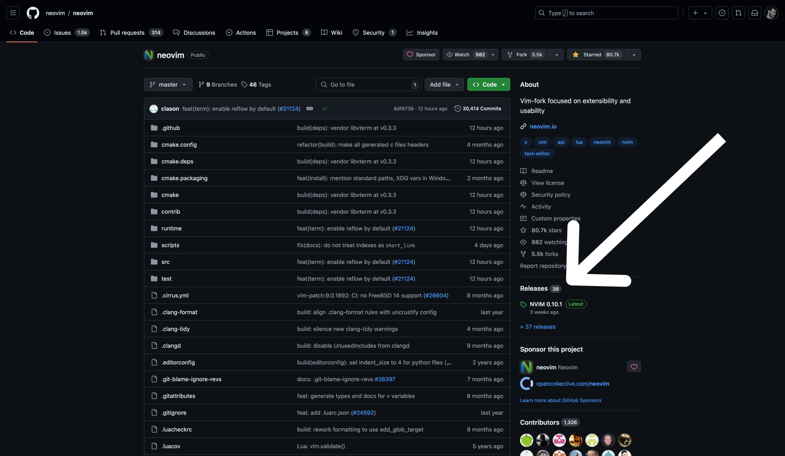

## Alright, listen up

VSCode? That's cute. But Neovim is for those who know what's up


## What did you say?

> "I don't know what is neovim ???"

Literally, Neovim lets you be the cool-looking guy behind the terminal. It's a text editor inside the terminal that you can customize to your liking. But since being a developer nowadays isn't just about what you create but also about the tools you use, Neovim is the way to go.

If you want to know more about Neovim :





---

## Now that we have that out of the way

If you are lazy like me, I'm here to help you getting started with a pre-configured Neovim setup. I have been using [NvChad](https://nvchad.com/) and tbh, it's really good.

- Easy to install
- Easy to customize
- Easy to use (if you know how to use Neovim but still)

But to be fair, you are not ready to read some docs and spend a bit of time setting up your Neovim, you can just use VSCode but you know...



## The TUTORIAL (finally)

What I'll be doing for the next 10 or 15 lines is to follow [the official documentation of NvChad](https://nvchad.com/docs/quickstart/install). But since you are to lazy to click on the link, I'll just explain it here again for you.


**Warning:** Remember that the versions and the steps might change in the future.


### Prerequisites

#### 1. Neovim 0.10

> I'm using MacOS, so I'll be using Homebrew.

```bash
brew install neovim
```

It is the safest way to install consistently the latest version of Neovim but at the time of writing, `brew` installs `0.10.1` and as I'm not satisfied with it, I installed Neovim by source.

To do that, go to the repo



- Go to [releases](https://github.com/neovim/neovim/releases) and look for the [0.10 version](https://github.com/neovim/neovim/releases/tag/v0.10.0)
  
- Download the correct zip file for your architecture below `Assets` (you may need to unfold the assets to show the zip files)
  
- Run the commands detailed in the `Assets` section of the release page for your OS

  ```bash
  # For MacOS
  xattr -c ./nvim-macos-x86_64.tar.gz
  tar xzvf nvim-macos-x86_64.tar.gz
  mv nvim-macos-x86_64/bin/nvim /usr/local/bin/nvim # move the binary to the bin folder
  rm -rf nvim-macos-x86_64.tar.gz nvim-macos-x86_64 # clean up
  ```

- Check on Neovim version

  ```bash
  nvim --version
  ```

#### 2. Nerd Font

You will have a Code editor in your terminal, you have to make sure that you have a font that supports the icons. I'm using [JetBrains Nerd Font](https://www.nerdfonts.com/font-downloads) (just `ctrl + f` in the page and Download the font).

Again, I don't know for other OS but on mac just open your `Font Book` and add the extracted font folder.

To set it in your terminal, go to your terminal settings and go to profile > text > change the font to the one you just added.


### Time to install


**Warning:** If you already have a Neovim config, make sure to back it up before proceeding.


> "How do I back up my Neovim config ??"

There you go:

```bash

```
