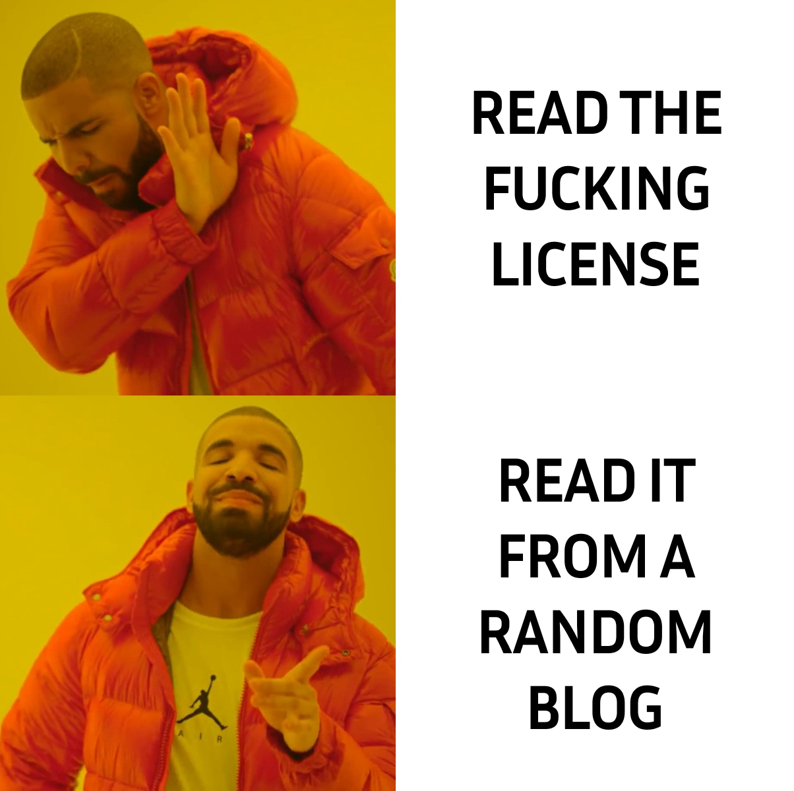
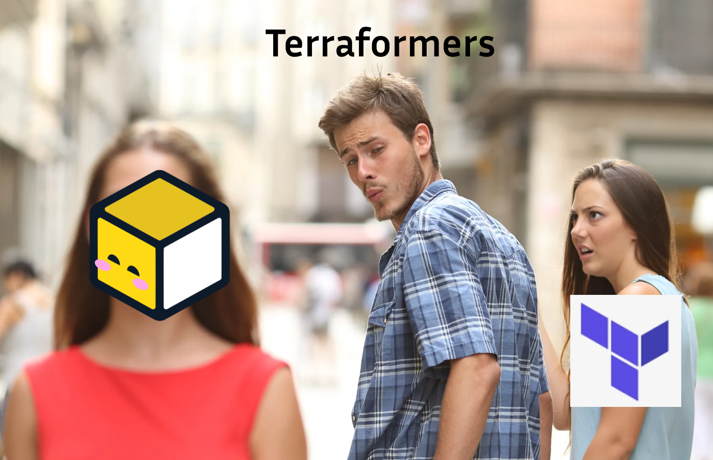

<!-- markdownlint-disable MD026 -->

## Are you a carnivore ?

If you're like me, you probably discovered Infrastructure as Code (IaC) with Terraform and you loved it. But maybe you're also like me and you have found that Terraform can be a bit annoying to use sometimes and that many _Terraform-Enhancers_ exist such as [Terramate](https://terramate.io/), [SpaceLift](https://spacelift.io/), [Overmind](https://overmind.tech/), Terragrunt (on which I already wrote an article).



But as I wandered through documentations and articles, I stumbled upon a new _**Vegetarian Terraform Alternative**_ : [**OpenTofu**](https://opentofu.org/).

Beside the fact that the mascot is hella cute, OpenTofu seems to have a lot of hype around it and everyone is talking integrating it into their project as a drop-in replacement for Terraform.

So, in the end, what makes it so special and maybe better than Terraform ?

## What is OpenTofu ?

OpenTofu is an **open-source** alternative to Terraform. It acts as a drop-in replacement for Terraform versions up to 1.5.7 and is compatible with Terraform providers, plugins and modules (they are available in the [OpenTofu Registry](https://opentofu.org/registry/)).
After HashiCorp Terraform switched to the Business Source License (BSL), OpenTofu was created to provide a more permissive license to the community.
They announced on August 25th, 2023 that they would fork Terraform and create OpenTofu in an attempt to keep Terraform open-source and free for everyone.

As of the time of writing, OpenTofu has 22k+ stars on github, 160+ companies and thousands of developers around the world backing it. The biggest _**Terraform-Enhancers**_ have already integrated OpenTofu into their products such as SpaceLift and Terragrunt.

> Pretty impressive for such a young project, right ?

## What is a BSL ?

If you're not a weirdo, prior to using any software, you probably **didn't read the license agreement**. So don't worry, I'll sum it up for you and you will understand that it is not that hard to just RTFM 🤡

You can read the full text of the HC Terraform BSL [here](https://github.com/hashicorp/terraform/blob/main/LICENSE).



Here’s the gist:

- **Source-Available**: The BSL allows you to access, modify, and distribute the source code, much like traditional open-source licenses. However, the key difference is in the limitations imposed on how you can use this code in commercial contexts.

- **Commercial Restrictions**: Under the BSL, you can use the software freely for development, testing, and internal business purposes. However, if you intend to offer a product or service that competes with the licensor's commercial offerings, especially on a paid basis, you'll need to acquire a commercial license from the licensor.

- **Change Date**: One of the unique aspects of the BSL is the built-in “Change Date.” After a specified period—typically four years from the release of a given version—the software license automatically transitions to a more permissive license, usually the Mozilla Public License 2.0 (MPL 2.0). This ensures that the software eventually becomes fully open-source, allowing broader commercial use without the original restrictions.

This transition to MPL 2.0 opens up the software for more extensive commercial use, allowing businesses to leverage the code without needing to worry about the earlier BSL constraints.

> From now on you will read the license agreement before using any software, right ?

## Why OpenTofu has so much hype ?

### BSL annoucement

On August 10th, 2023, HashiCorp announced that Terraform would switch to the Business Source License (BSL) without any prior notice. This license is a source-available license that allows you to use the software for free, but with some restrictions on commercial use. This means that if you are building a product that competes with HashiCorp's products, you will need to pay for a commercial license to use Terraform in production.
The BSL also says that after four years, the software automatically switches over to a more permissive license, MPL 2.0. Sounds cool, right? But until those four years are up, everyone is stuck with the BSL, and that can be a pain for long-term projects that don’t wanna deal with surprise license changes.

This announcement was a shock for the community and many companies that rely on Terraform in their infrastructure were on a shaky ground.

### OpenTofu Manifesto

In the following weeks, big Terraform projects such as Terramate, SpaceLift, Terragrunt and others gathered and released the [OpenTF manifesto](https://opentofu.org/manifesto/). This manifesto is a call to action for HashiCorp to reconsider their decision and keep Terraform open-source or to fork Terraform and create an open-source alternative. This is how OpenTofu was born.

They next completed all documents to make OpenTofu part of the Linux Foundation with the goal of making it a CNCF project. This would ensure that OpenTofu would be maintained by the community and not by a single company who could change the license at any time (like HashiCorp did).

On September 5th, 2023, OpenTofu was officially released and the community was thrilled.

## Why Terraform should be open-source ?

By annoucing the switch to BSL, HashiCorp tried to block competition and force companies to use their paid products. This is a common strategy in the software industry, but it can also backfire. By creating OpenTofu, the community showed that they can work together to create a better alternative and that competition is good for innovation because it forces companies to improve their products and level up their game.

I made this paragraph because I wanted to mention this piece of text on the [OpenTofu blog](https://opentofu.org/blog/why-should-i-care-about-opentofu/#competition-is-good) and I think it's a good summary of the situation.

**OpenTofu emerged as a collaborative effort from the community and competing companies**, demonstrating that competition drives innovation. By challenging HashiCorp's dominance, OpenTofu encourages continuous improvement, benefiting users through better products, faster updates, and more competitive pricing. Ultimately, **this type of competition strengthens the entire Infrastructure as Code ecosystem**.

## Should you use OpenTofu or Terraform ?

Obviously, OpenTofu **is not** Terraform. They are the same thing for now, but they will **diverge** over time. If you are starting a new project, you should consider the time you begin to use OpenTofu. If you are already using Terraform, you should consider if you are really impacted by the license change. If you are not, you can continue to use Terraform in my opinion. If you are, you should really consider if you prefer risking migrating to OpenTofu or risking a new license change in the future.

I haven't quite seen the technical aspect of switching to OpenTofu, but I think it's a good idea to keep an eye on it and maybe try it out in a side project to see if it fits your needs.

## Future of IaC

I believe that the future of IaC is **bright**.

Interest in OpenTofu (_or perhaps the waves it will create in the ecosystem_) will grow and become a major issue for the IaC ecosystem. This will force HashiCorp to reconsider their license change and maybe switch back to a more permissive license. But even if they don't, **HC might come up with defensive strategies to keep their market share**.
**Large companies such as GitLab are already ditching Terraform in favor of OpenTofu** and I think that is a good indicator of the tendencies in the IaC ecosystem.

As [Sören Martius](https://x.com/sorenmartius), Co-Founder of [_Terramate_](https://terramate.io/) said in his [speak](https://youtu.be/Lb_ITAuHa28) at PlatformCon 2024, the best case scenario would be that **OpenTofu and Terraform merged back together under the Linux Foundation** and that the community would maintain the project. This would ensure that Terraform would _stay_ open-source and _free_ for everyone.
