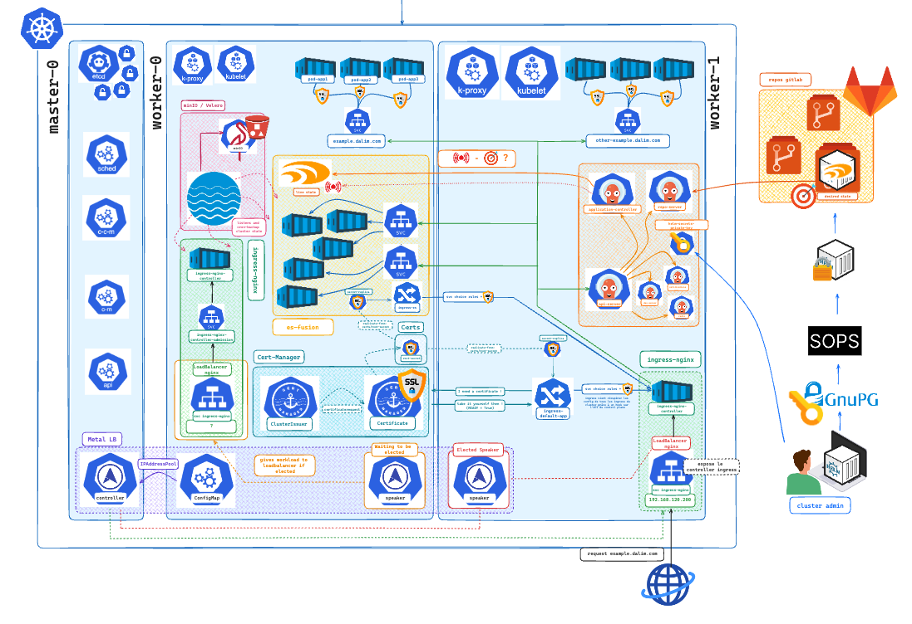
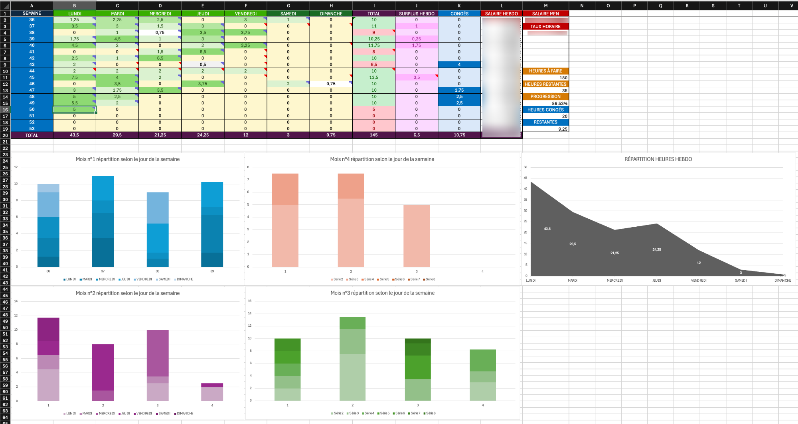
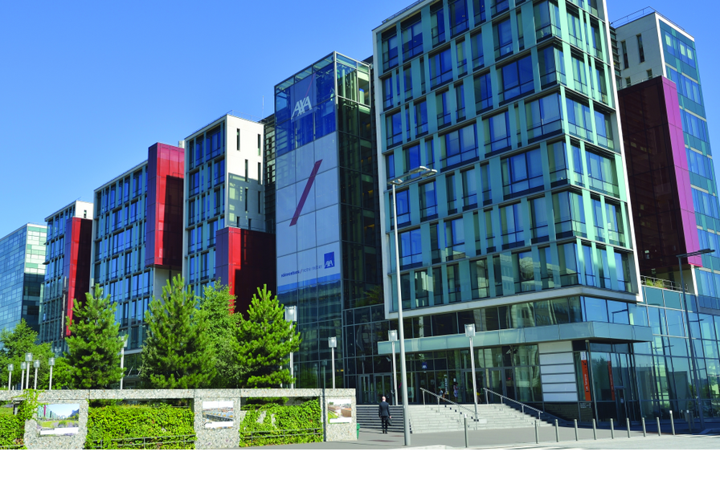

## Hey what's up ?

Hey, I'm currently in my last year of engineering school in France and I'm working part-time as a cloud engineer at a german company since September.
For the past 4 months (at the time of writing), I've been working 10 hours a week while studying full-time and I'm here to share my experience with you.

The company I'm working for is [Dalim Software](https://www.dalim.com/), a software company that provides solutions for the media industry. I'm part of the IT team and I'm working on the infrastructure as code (IaC) of the company's products.

## How did I land this job ?

My engineering school mandates a 3-month internship abroad in the 4th year of the curriculum. I did mine at [Dalim Software](https://www.dalim.com/) during Summer 2024.

I live in Strasbourg, and the company is based in Kehl, Germany, just across the Rhine River. I was fortunate to find a place _abroad_ to work during my internship, and I commuted to work by tram every day.

I was originally hired in the IT team to work on the kubernetes infrastructure of the new product the company was developing and since I did a good job during my internship, the company offered me a part-time _full-remote_ job for the rest of my studies.

_^ Kubernetes infrastructure I deployed during my internship_

I accepted the offer because tha valuable experience I was getting was worth the time I was spending on it.

## How do I manage my time ?

The (not so) cool thing with being a student is that each week is different: some weeks are busy with exams, some are not. Some weeks you work only for 3 days, some weeks you work all 5. Not having a fixed schedule is _truly a blessing_ ಥ_ಥ

So as you could guess, I have to constantly adapt my time a bit ahead of time. I have to look weeks in advance and try to be flexible and adapt to the unexpected because sometimes professors charge you with a last-minute assignment. And that's fine, I just have to be there just like the other students.

Lucky for me, [Dalim](https://www.dalim.com/) (more particularly my manager) is very understanding and compliant with my student status. I can work from home when I have to study for exams or when I have to attend a class. I can also work more hours during the holidays to compensate for the weeks I couldn't work.

## How do I keep up the motivation ?

At the beginning of my contract, I built an _excel sheet_ to track the hours I worked each week and the hours I have left to work. I also use it to log the tasks I've done and the tasks I have to do. This way, I can keep track of my progress and see how much I've accomplished.

But some weeks are harder than others. Some weeks I'm tired, some weeks I'm not motivated, some weeks I have a lot of exams. And I have to admit that sometimes **I just want to chill** and do nothing like all the other students ahah but I guess my todo list isn't going to do itself.

Actually, I'm quite proud of my excel sheet because I made it very colorful and I added some conditional formatting to make it look **cool**. I also added some graphs to visualize my progress and I'm quite happy with the result.
Each day I add a comment on the cell of the day with the tasks I've done. This way, my manager can see what I've done since I work remotely.

## What did I learn ?

Throughout this part-time experience, I have gained extensive knowledge in cloud technologies and infrastructure as code (IaC) tools, honed my time management and organizational skills, mastered remote work and effective team communication, and developed a strong sense of independence and initiative-taking.

### Infrastructure as code (IaC)

- I'm confortable using [Terragrunt](https://www.gruntwork.io/)
- I crafted a lot of [Terraform](https://www.terraform.io/) modules
- I'm much more familiar with [AWS](https://aws.amazon.com/) services than before

### Working remotely

- I'm using [Confluence](https://www.atlassian.com/software/confluence) to publish my documentations for the rest of the team
- I used [Teams](https://www.microsoft.com/fr-fr/microsoft-teams/group-chat-software) a lot to communicate with IT team members

### Communication

- I'm aware that other people are not up to date with what I'm doing so I'm making sure to communicate with them
- I'm also aware that I can ask for help when I need it
- Be being autonomous I learnt how to be naturally proactive and take initiatives when needed

---

## Conclusion

I'm very grateful for this opportunity and I'm glad I accepted it. Even though it's not always easy to have to juggle between work / studies / friends / sports, I think it was worth it. Now I can brag about my experience and my skills in interviews and I can also say that I've been working for a german company for about a year (10 hours a week but still).

## And now ?

Thanks to this experience, I've been able to land a internship at **[AXA](https://www.axa.com/) in Paris, located in _La Défense_ debuting in March 2025 !**
I'll be working full-time for 6 months in the Cloud Program as a **Cloud Engineer Intern**.

I'm very excited to start this new adventure and I'm looking forward to learning new things and meeting new people.

