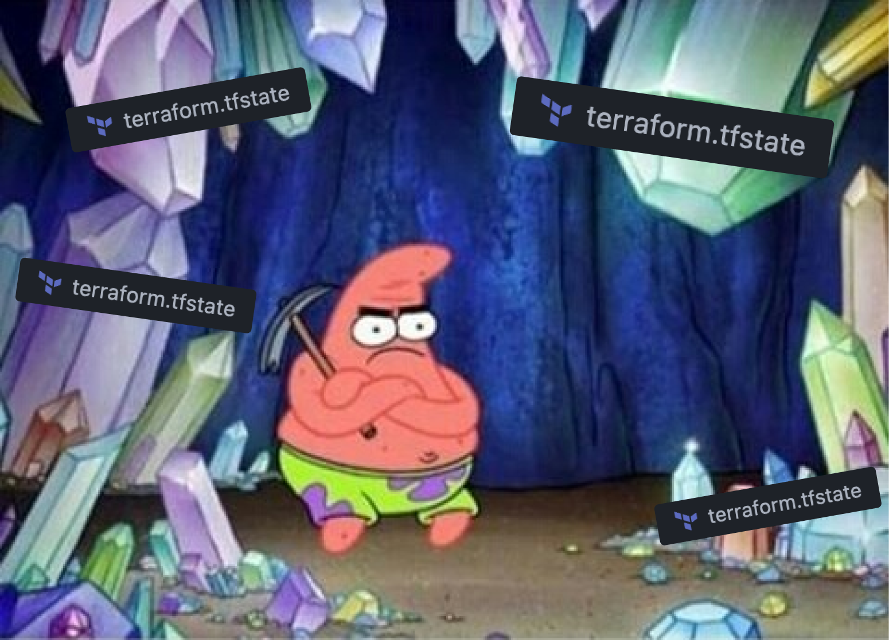
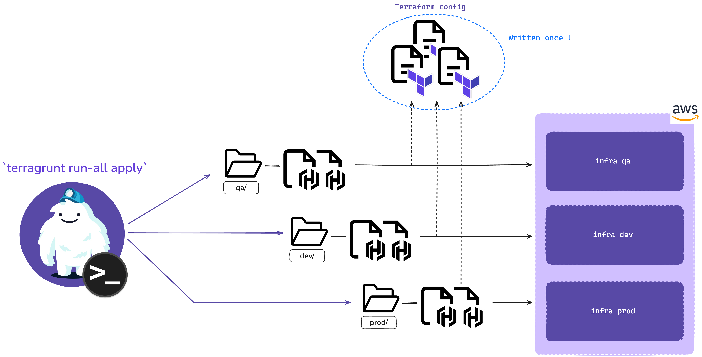
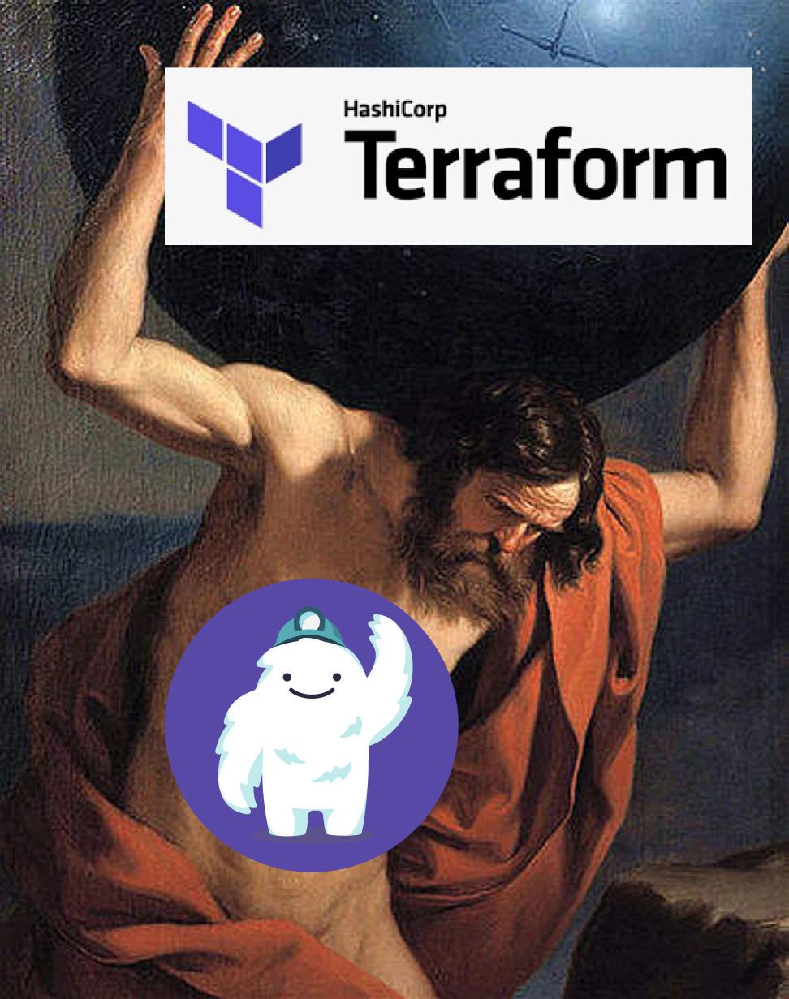

## Hey Terraformers (•̀ᴗ•́ )و ̑̑

Alright, so I’ve been messing around with Terraform for a bit, and guess what? It’s pretty rad. But like every cool tool out there, there’s always that one thing that just... isn’t quite right.

- You don't know how to **manage multiple backend configurations** ?
- You're tired of **copy-pasting** the same code for different environments ?
- You're struggling with **managing dependencies** between modules ?



Enter Terragrunt. This little gem might just be the answer to all your Terraform woes. It’s like the secret sauce that takes your Terraform game to the next level.

> But hey, I’m still kind of new at this, so cut me some slack if I get a bit ahead of myself.

## What is Terragrunt ?



> "Terragrunt is a flexible orchestration tool that allows Infrastructure as Code written in Terraform to scale."


In simple terms, Terragrunt is a Terraform wrapper that helps you deploy and manage your complex infrastructure with lot less code. It "_functionizes_" your Terraform code, to which you can pass in different set of inputs following the _environment_ / _region_ / _account_ you are deploying to (AWS mates, I'm looking at you).

### The Problem with Terraform

Terraform is amazing. You define your infrastructure in code, and boom, you’ve got a cloud setup that’s version-controlled and replicable.

But the thing is, when you start working with multiple environments (like staging, production, etc.), or multiple regions, you quickly realize that you're writing the same code again and again with just a few tweaks here and there.

Imagine having a **huge Terraform configuration** file for your staging environment and then another almost identical config file for production, and then another one for testing. It gets old fast, and it’s a maintenance nightmare. Not to mention, you have to manage your backend configurations separately for each environment. Ugh.

### The yeti in the room

So, Terragrunt swoops in and says, "Hey, why not just write that code once and reuse it?" And that’s the beauty of it.



You can define your infrastructure code once in Terraform modules and use Terragrunt to handle the different configurations for your environments. It’s like Terraform, but with a DRY martini in hand.

Here’s a quick look at what Terragrunt does really well:

#### 1. **DRY All the Things**

Terragrunt promotes DRY principles by allowing you to reuse your Terraform code across multiple environments and regions. Instead of copy-pasting your `.tf` files for every environment, you can create a single module and then **use Terragrunt’s configuration files to specify the differences** for each environment. It’s like having a master template for your infrastructure, and it’s _glorious_.

Its architecture allows you to merge multiple grunt configuration files, so you can define your infrastructure in a modular way and then combine the configurations for different environments.

<!-- uses `bash` because `hcl` highlighting is shit -->

```bash
# live/terragrunt.hcl
inputs = merge(
  local.account_vars.locals, # overriden by region_vars
  local.region_vars.locals, # overriden by environment_vars
  local.environment_vars.locals # overriden by module-specific vars
);
```

the `inputs` block is used to pass variables to the TF config. These variables are marged, so you can benefit from the _cascade_ effect and avoid repeating the same values that are common across multiple configuration levels.

#### 2. **Keep Your Backend Config Consistent**

Ever mess up your backend configuration in Terraform? Yeah, we’ve all been there. With Terragrunt, you can manage your backend configuration in one place and apply it across all your environments. No more copy-pasting S3 bucket names or DynamoDB table configurations.

You can even dynamically generate your backend configurations based on the environment you’re deploying to.

```bash
# live/terragrunt.hcl
remote_state {
  backend = "s3"
  generate = {
    path      = "backend.tf"
    if_exists = "overwrite_terragrunt"
  }
  config = {
    bucket         = "my-state-bucket"
    key            = "${path_relative_to_include()}/tf.tfstate"
    region         = ${local.region_vars.locals.aws_region}
  }
}
```

#### 3. **Dependency Management**

Terraform's native support for dependencies between modules is cool, but managing these dependencies across different Terraform workspaces can be a pain.
Terragrunt simplifies this by allowing you to define the dependencies in a more straightforward way, ensuring that your resources are applied in the correct order.

```bash
# live/non-prod/eu-west-1/dev/app/terragrunt.hcl
terraform {
  source = "*{include.envcommon.locals.base_source_url}

dependency "vpc" {
  config_path = "${get_parent_terragrunt_dir()}/vpc"

  mock_outputs = {
    vpc_id = "mock-vpc-id"
  }
}

inputs = {
  vpc_id = dependency.vpc.outputs.vpc_id
}
```

## Why Terragrunt Might Seem Like a Pain

Now, I get it. You might be thinking,

> "This sounds awesome, but why does Terragrunt sometimes feel like ~~a nightmare~~ overkill?"

Well, like everything in tech, Terragrunt isn’t perfect. It adds an extra layer of complexity to your Terraform setup. There’s a **learning curve involved**, and if you’re not careful, you might end up with a tangled mess of `terragrunt.hcl` files that are **harder to debug** than the original Terraform code.

Plus, if your team isn’t familiar with Terragrunt, onboarding them _might take some time_. You have to weigh the initial complexity against the long-term benefits.

> In my case, I was charged with exploring Terragrunt for a new project. I had to learn the ins and outs of Terragrunt, set up the configurations, and then teach my team how to use it. It was a bit of a learning curve, but once we got the hang of it, we were able to manage our infrastructure code more efficiently.

## But Seriously, Why Terragrunt Rocks

Despite the complexity, I’m a big fan of Terragrunt.

When you’re dealing with multiple environments and need to ensure that your infrastructure code is consistent, Terragrunt is a lifesaver. It helps you _manage configurations at scale_, _reduces errors_, and makes your codebase _a lot easier to maintain_.

In the long run, the time you invest in learning and setting up Terragrunt pays off. You’ll have a more organized, scalable, and maintainable infrastructure codebase. And let’s be real, **who doesn’t want that**?



> I'm looking forward to making a tutorial on how to set up Terragrunt for your Terraform projects, maybe later this month
