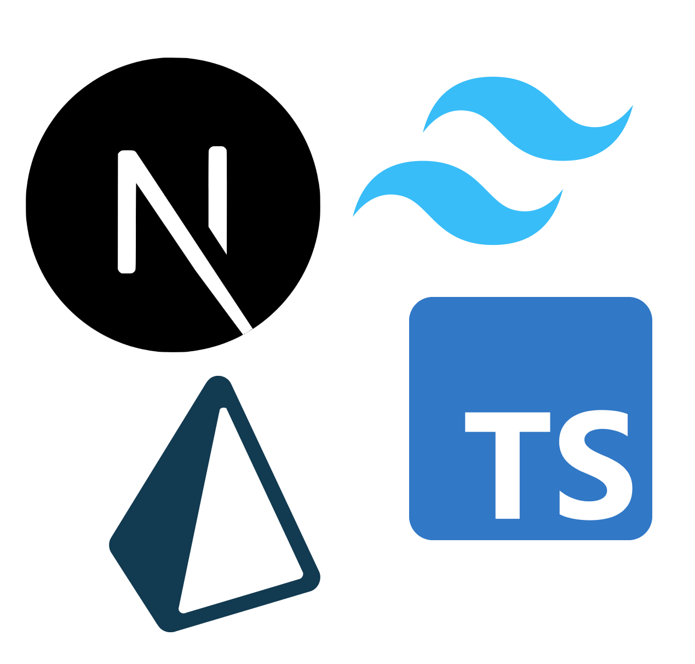
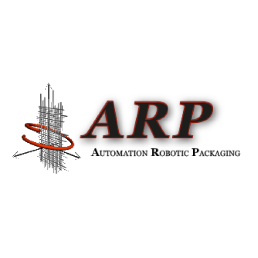
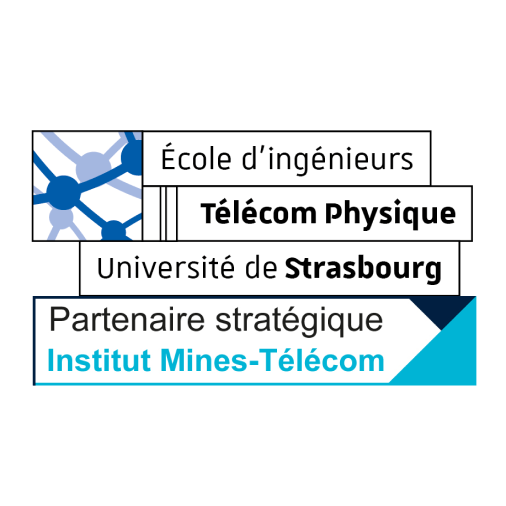
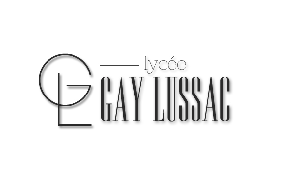

## Computing Skills


Filling my brain with cool stuff – always a win






---

## Experience

<table>
    <thead>
        <tr>
            <th>Company</th>
            <th>Link</th>
            <th>Role</th>
            <th>Dates</th>
            <th>Location</th>
        </tr>
    </thead>
    <tbody>
        <tr>
            <td rowspan=3></td>
            <td rowspan=3><a href="https://www.dalim.com/" target="_blank">Dalim Software GmbH</a></td>
        </tr>
        <tr>
            <td>Junior Cloud Architect</td>
            <td>Sept - Present</td>
            <td>Full Remote   Strasbourg, FR</td>
        </tr>
        <tr>
            <td>Sys admin / SRE intern</td>
            <td>May - August 2024</td>
            <td>On site   Kehl, GE</td>
        </tr>
        <tr>
            <td></td>
            <td><a href="https://fr.linkedin.com/company/a.r.p.-automation-robotic-packaging" target="_blank">Automation Robotic Packaging</a></td>
            <td>Fullstack Web Dev Intern</td>
            <td>Summer 2023</td>
            <td>On site   Châteauroux, FR</td>
        </tr>
    </tbody>
</table>

---

## Education

<table>
    <thead>
        <tr>
            <th>School</th>
            <th>Link</th>
            <th>Degree</th>
            <th>Date</th>
        </tr>
    </thead>
    <tbody>
        <tr>
            <td rowspan=4></td>
            <td rowspan=4><a href="https://www.telecom-physique.fr/" target="_blank">Télécom Physique Strasbourg</a></td>
        </tr>
        <tr>
            <td>Data science engineer</td>
            <td>2025</td>
        </tr>
         <tr>
            <td>Signal & systems engineering</td>
            <td>2024</td>
        </tr>
        <tr>
            <td>Generalist</td>
            <td>2023</td>
        </tr>
        <tr>
            <td rowspan=3></td>
            <td rowspan=3>Lycée Gay Lussac</td>
        </tr>
        <tr>
            <td>BSc, Computer Science - Distributed Systems</td>
            <td>20</td>
        </tr>
    </tbody>
</table>
